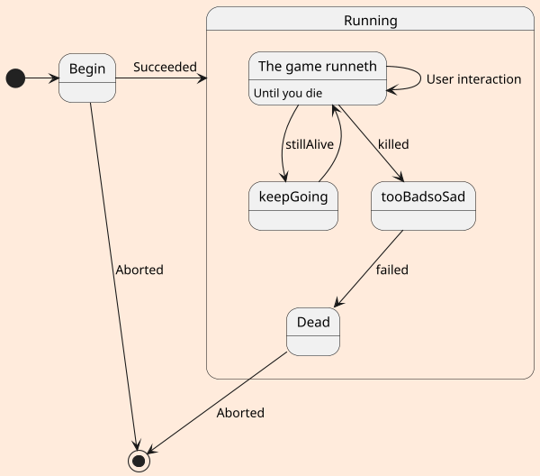

# this is a test of UML

## first diagram

````plantuml
@startuml
    skinparam backgroundColor #aEEBDC
    skinparam handwritten false
    actor jeremy
    Customer -> "login()" : username & password
    "login()" -> Customer : session token
    activate "login()"
    Customer -> "placeOrder()" : session token, order info
    "placeOrder()" -> Customer : ok
    Customer -> "logout()"

    "logout()" -> Customer : ok
    deactivate "login()"
@enduml
````

## uml: state diagram



## describing PSPrompt in UML

````plantuml
@startuml
actor User
    User-> "PSPrompt Module()" : Install Module
    User-> "PSPrompt Module()" : Import Module


@enduml
````

